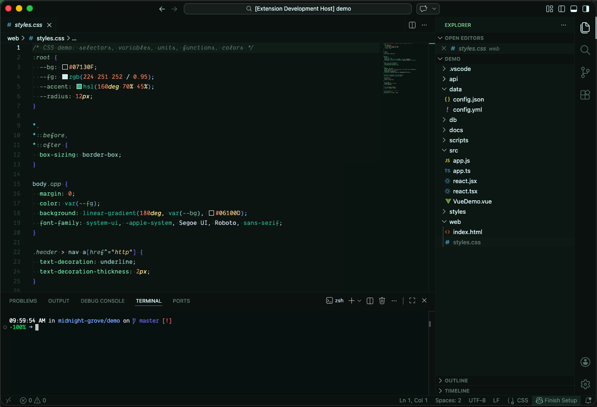
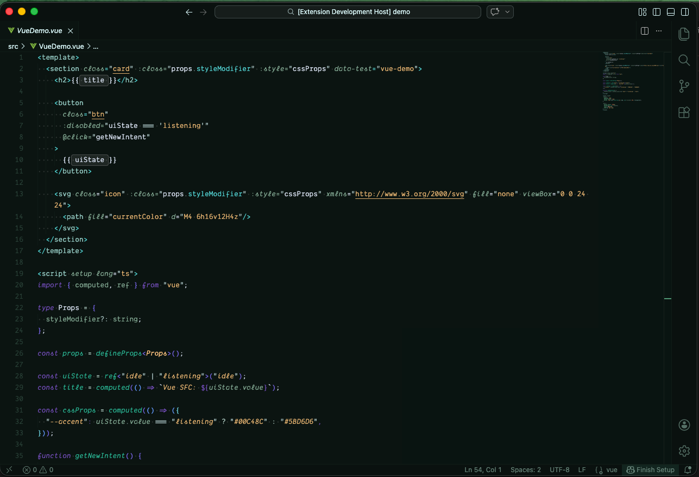
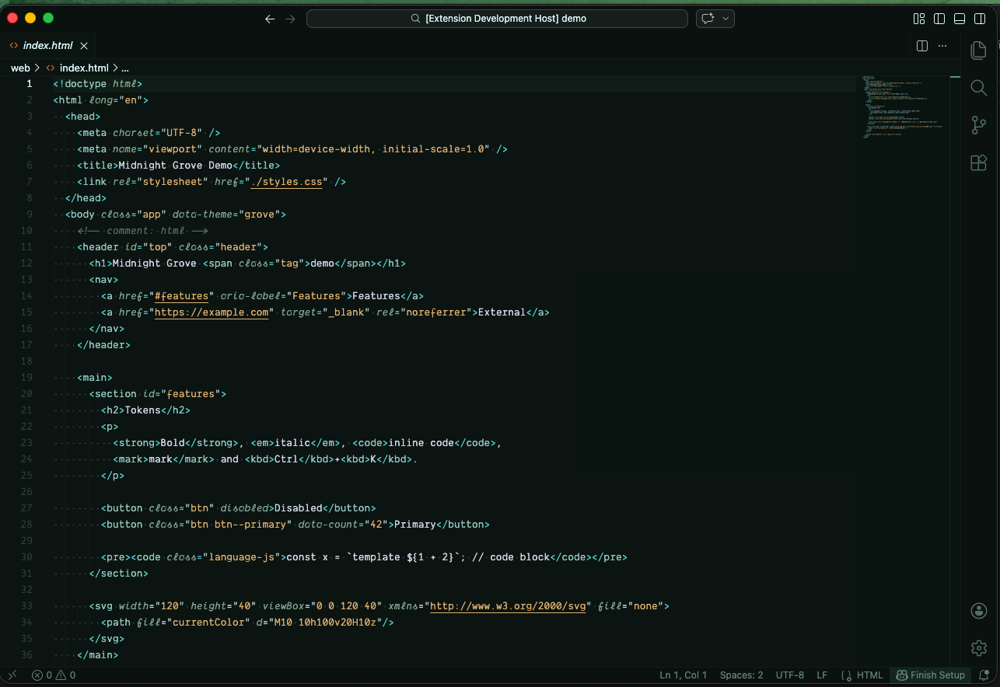
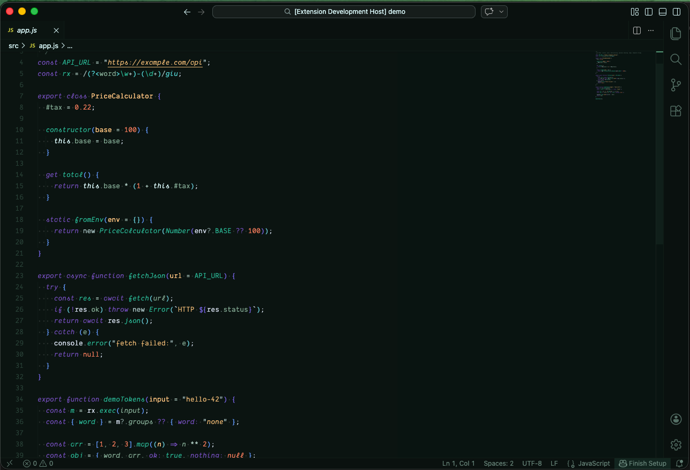

# Midnight Grove 🌙🌲

Midnight Grove is a forest-inspired dark theme for Visual Studio Code.

It uses deep greens and soft accent colors to create a calm coding environment while keeping syntax clear and readable.

## Highlights

* Forest-inspired dark palette
* Calm color balance designed to stay comfortable during long coding sessions
* Clear syntax highlighting without overly saturated colors
* Designed with modern web development in mind

## Preview

## Installation

1. Open **Extensions** in VS Code
2. Search for `Midnight Grove`
3. Click **Install**
4. Activate it via Settings > Themes > Color Theme

## Feedback

If you notice issues or have suggestions, feel free to [file an issue](https://github.com/lelamanolio/midnight-grove-vstheme/issues).

The palette was partially inspired by the
[Night Owl Theme](https://marketplace.visualstudio.com/items?itemName=sdras.night-owl),
which served as a starting point for building this theme.

Enjoy coding in the grove 🌲
